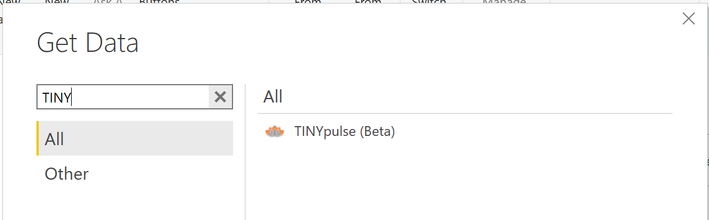
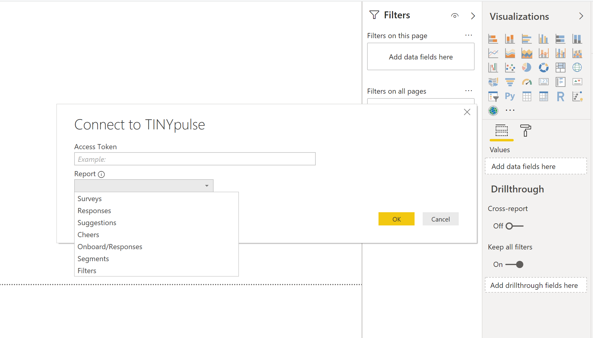
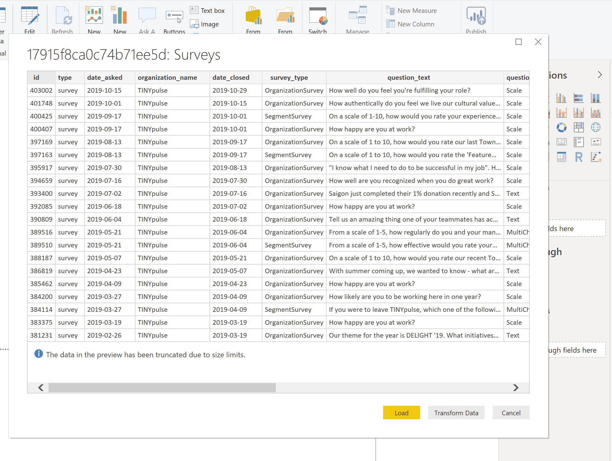

# TINYpulse PowerBI_Connector

# Getting Started with Data Connectors

Data Connectors for Power BI enables users to connect to and access data from your application, service, or data source, providing them with rich business intelligence and robust analytics over multiple data sources. By integrating seamlessly into the Power Query connectivity experience in Power BI Desktop, Data Connectors make it easy for power users to query, shape and mashup data from your app to build reports and dashboards that meet the needs of their organization.

Data Connectors are created using the [M language](https://msdn.microsoft.com/library/mt211003.aspx). This is the same language used by the Power Query user experience found in Power BI Desktop and Excel 2016. Extensions allow you to define new functions for the M language, and can be used to enable connectivity to new data sources. While this document will focus on defining new connectors, much of the same process applies to defining general purpose M functions. Extensions can vary in complexity, from simple wrappers that essentially just provide "branding" over existing data source functions, to rich connectors that support Direct Query.

Please see the [Power Query Connector Developer Reference](https://docs.microsoft.com/en-us/power-query/handlingauthentication) for more details.

## Quickstart

1. Install the [Power Query SDK](https://aka.ms/powerquerysdk) from the Visual Studio Marketplace
2. Create a new Data Connector project
3. Define your connector logic
4. Build the project to produce an `mez` extension file. It is in `bin/Release` folder.
5. Copy the extension file into the `[Documents]\Power BI Desktop\Custom Connectors` directory
6. Open Power BI Desktop

Note, to load extensions during development, you will need to lower the security level for extensions in Power BI Desktop to enable loading unsigned/uncertified connectors.

1. Go to File | Options and settings | Options
2. Go the Security tab
3. Under *Data Extensions*, select *Allow any extension to load without warning or validation*
4. Restart Power BI Desktop

### Screenshots

## Additional Links and Resources

* [Data Connector Technical Reference](docs/m-extensions.md)
* [M Library Functions](https://msdn.microsoft.com/library/mt253322.aspx)
* [M Language Specification](https://msdn.microsoft.com/library/mt807488.aspx)
* [Power BI Developer Center](https://powerbi.microsoft.com/developers/)
* [Data Connector Tutorial](https://github.com/Microsoft/DataConnectors/tree/master/samples/TripPin)